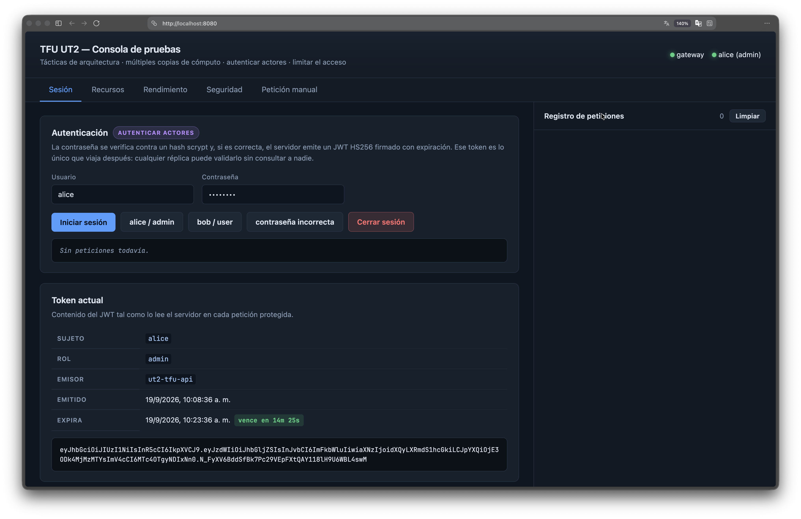
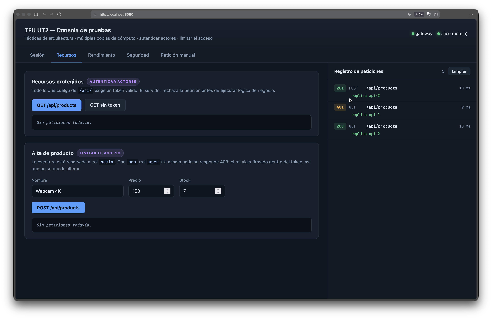
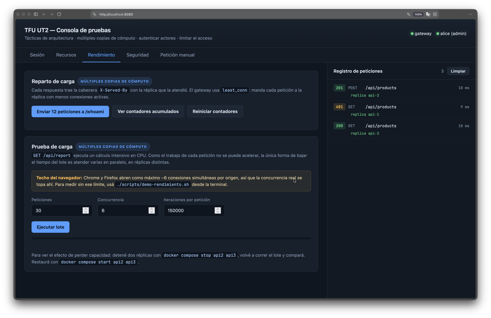
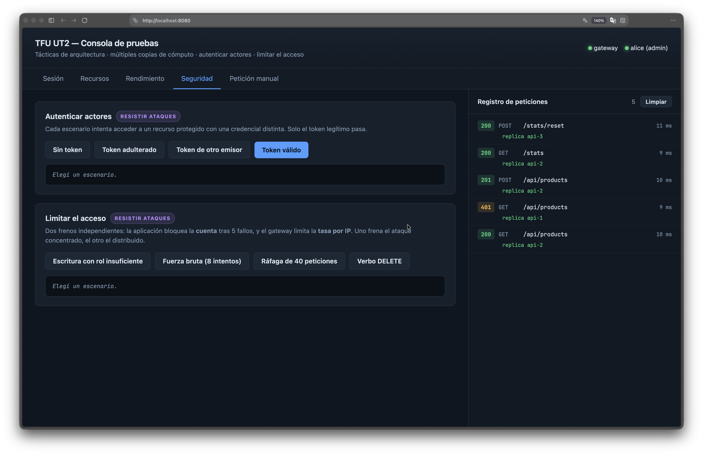
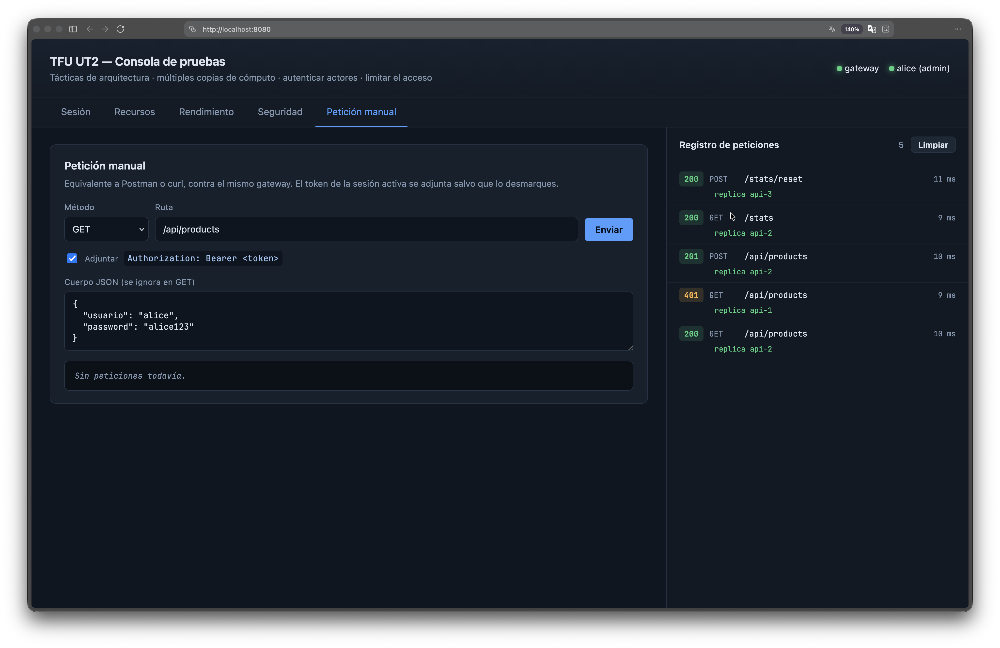

# TFU UT2 — Tácticas de Arquitectura

**Autores:** Adolfo Bravo – Agustin Cigaran – Brahina Nuñez - Matias Perez

API REST de demostración que combina, en un mismo sistema:

| Atributo de calidad | Táctica |
|---|---|
| **Rendimiento** | Mantener múltiples copias de cómputo (3 réplicas + balanceo de carga) |
| **Seguridad** — resistir ataques | Autenticar actores (scrypt + JWT HS256) |
| **Seguridad** — resistir ataques | Limitar el acceso (rate limiting, bloqueo de cuenta, superficie de red mínima) |

> **Entregable de la Parte 1** (requerimientos no-funcionales y justificación de
> las tácticas): [`docs/Parte1-Requerimientos-y-Tacticas.pdf`](docs/Parte1-Requerimientos-y-Tacticas.pdf).
> El Markdown fuente está junto al PDF; para regenerarlo, `./scripts/generar-pdf.sh`.

---

## Arquitectura

```
                       host  (un solo puerto publicado)
                            │
                    ┌───────▼────────┐
                    │  gateway nginx │   límite de tasa por IP · verbos permitidos
                    │  least_conn    │   único punto de entrada
                    └───┬───┬────┬───┘
              ┌─────────┘   │    └─────────┐        red interna, sin salida a internet
        ┌─────▼─────┐ ┌─────▼─────┐ ┌──────▼────┐
        │   api-1   │ │   api-2   │ │   api-3   │   réplicas idénticas y sin estado
        └─────┬─────┘ └─────┬─────┘ └──────┬────┘   (misma imagen: ut2-tfu/api:1.0.0)
              └─────────────┼──────────────┘
                      ┌─────▼─────┐
                      │   redis   │   estado compartido: contadores, bloqueos
                      └───────────┘
```

## Requisitos

Solo **Docker** con Compose v2. La aplicación no tiene dependencias de npm: la
imagen se construye sin necesidad de descargar paquetes.

## Cómo ejecutarlo

```bash
./scripts/start.sh
```

El script construye la imagen, levanta los cinco contenedores, espera a que estén
sanos e imprime la URL base. Publica el puerto **8080**; si estuviera ocupado
elige automáticamente el siguiente libre y lo informa.

## Interfaz de prueba (UI)

Además de los scripts y `curl`, el gateway sirve en la misma URL base una consola
web (`http://localhost:8080`, o el puerto que haya elegido `start.sh`) para probar
todo a mano, sin herramientas externas.

| Sesión | Recursos |
|---|---|
|  |  |

| Rendimiento | Seguridad |
|---|---|
|  |  |

También hay una pestaña **Petición manual**, equivalente a Postman/curl contra el mismo gateway:



### Paso a paso mínimo para verificar que los scripts andan bien

1. `./scripts/start.sh` y abrir la URL que imprime.
2. **Sesión** → botón `alice / admin` → `Iniciar sesión`. Si aparece el JWT
   decodificado (sujeto, rol, expiración), la autenticación (`auth.js`) funciona.
3. **Recursos** → `GET /api/products` debe dar `200` con el listado; `GET sin
   token` debe dar `401`. Con `alice` (admin), `POST /api/products` da `201`;
   repitiendo con `bob` (user) debe dar `403` — confirma "limitar el acceso" por rol.
4. **Rendimiento** → `Enviar 12 peticiones a /whoami` y mirar el **Registro de
   peticiones**: las respuestas deben repartirse entre `api-1`, `api-2` y
   `api-3`. Si siempre responde la misma réplica, el balanceo no está andando.
5. **Seguridad** → `Sin token`, `Token adulterado` y `Token de otro emisor`
   deben fallar los tres; `Fuerza bruta (8 intentos)` debe terminar bloqueando
   la cuenta antes de agotar los intentos; `Ráfaga de 40 peticiones` debe
   cortar por *rate limit* del gateway.
6. Con los scripts de demo corriendo en otra terminal
   (`./scripts/demo-rendimiento.sh`, `./scripts/demo-seguridad.sh`), usar
   `Ver contadores acumulados` en **Rendimiento** para chequear que los
   números coinciden con lo que reporta el script.
7. `./scripts/stop.sh` al terminar.

## Demostraciones

```bash
./scripts/demo-rendimiento.sh    # múltiples copias de cómputo
./scripts/demo-seguridad.sh      # autenticar actores + limitar el acceso
./scripts/demo-todo.sh           # ambas en secuencia
./scripts/stop.sh                # detener y limpiar
```

`demo-rendimiento.sh` acepta variables de entorno para ajustar la carga:

```bash
PETICIONES=120 CONCURRENCIA=24 ITERACIONES=200000 ./scripts/demo-rendimiento.sh
```

## Prueba manual con curl

```bash
BASE=http://localhost:8080     # ajustar si start.sh eligió otro puerto
```

```bash
# 1. Sin credenciales: rechazado
curl -i $BASE/api/products

# 2. Autenticarse (alice = admin, bob = user)
TOKEN=$(curl -s -X POST $BASE/auth/login \
  -H 'Content-Type: application/json' \
  -d '{"usuario":"alice","password":"alice123"}' | sed -n 's/.*"token": "\([^"]*\)".*/\1/p')

# 3. Con token: autorizado
curl -s $BASE/api/products -H "Authorization: Bearer $TOKEN"

# 4. Ver qué réplica respondió (cabecera X-Served-By)
for i in $(seq 1 6); do curl -s -D - -o /dev/null $BASE/whoami | grep -i x-served-by; done

# 5. Reparto de carga acumulado
curl -s $BASE/stats
```

## Endpoints

| Método | Ruta | Acceso | Descripción |
|---|---|---|---|
| GET | `/health` | público | Estado de la réplica (usado por el healthcheck) |
| GET | `/whoami` | público | Réplica que atendió, PID y estado de Redis |
| GET | `/stats` | público | Peticiones atendidas por cada réplica |
| POST | `/stats/reset` | público | Reinicia los contadores (utilidad de demo) |
| POST | `/auth/login` | público | Devuelve un JWT. Cuerpo: `{"usuario","password"}` |
| GET | `/api/products` | JWT | Lista de productos |
| POST | `/api/products` | JWT + rol `admin` | Alta de producto |
| GET | `/api/report?iter=N` | JWT | Cálculo intensivo en CPU (para la demo de rendimiento) |

**Usuarios de demostración:** `alice` / `alice123` (rol `admin`) · `bob` / `bob123` (rol `user`).

## Estructura del repositorio

```
.
├── docker-compose.yaml                     despliegue: gateway + 3 réplicas + redis
├── api/
│   ├── Dockerfile
│   └── src/
│       ├── server.js                       rutas, autorización, endpoint CPU-bound
│       ├── auth.js                         scrypt + JWT HS256  → "autenticar actores"
│       └── redis.js                        cliente Redis mínimo (estado compartido)
├── gateway/
│   ├── nginx.conf                          balanceo + rate limiting
│   └── proxy_comun.conf
├── scripts/
│   ├── start.sh · stop.sh
│   ├── demo-rendimiento.sh · demo-seguridad.sh · demo-todo.sh
│   ├── generar-pdf.sh                  regenera el PDF de la Parte 1
│   └── comun.sh
├── tools/
│   └── md2pdf.py                       Markdown → HTML → PDF (Chromium)
└── docs/
    ├── Parte1-Requerimientos-y-Tacticas.pdf     ← entregable Parte 1
    └── Parte1-Requerimientos-y-Tacticas.md      fuente
```

## Nota sobre los secretos

`JWT_SECRET` viaja en `docker-compose.yaml` con un valor por defecto para que la
demo funcione sin configuración previa. En un entorno real debe provenir de un
gestor de secretos; las contraseñas de los usuarios de ejemplo están hardcodeadas
por el mismo motivo y en producción vivirían en una base de datos.
